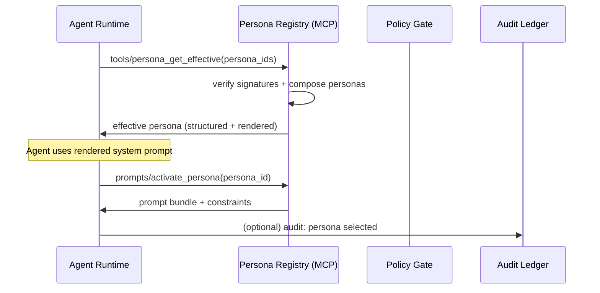
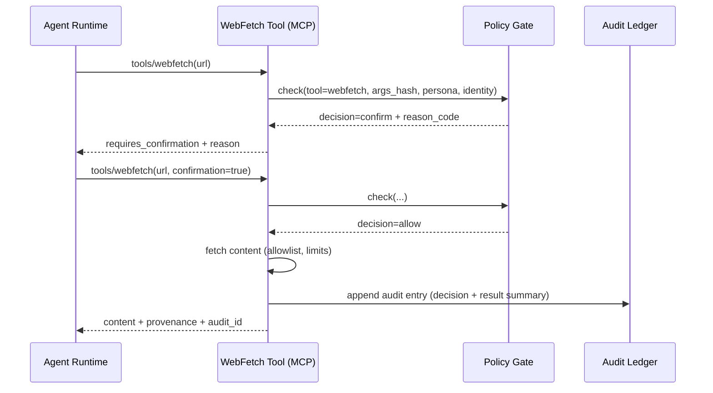
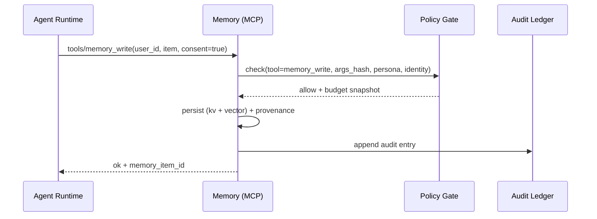
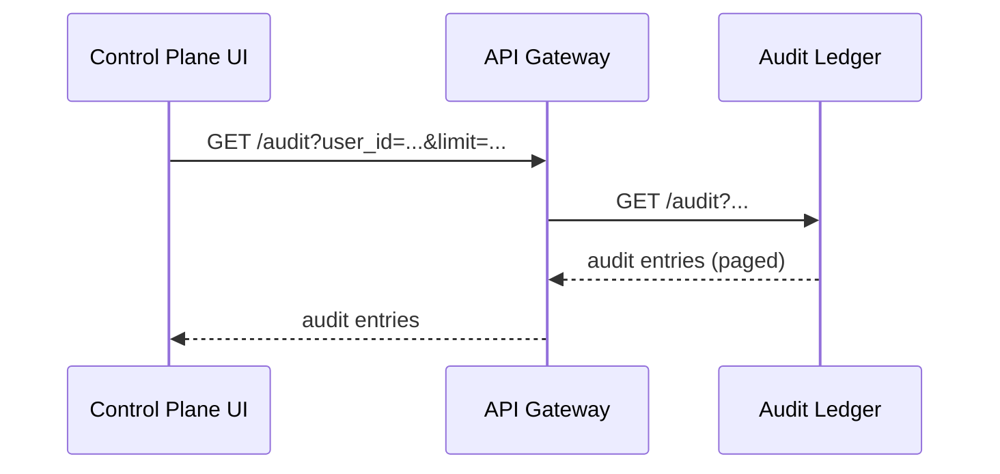

# Data Flows

This file describes end-to-end flows with sequence diagrams.

---

## 1) Persona activation

---

## 2) Tool call gating (high risk action)

---

## 3) Memory write (opt-in)

---

## 4) Audit query flow

