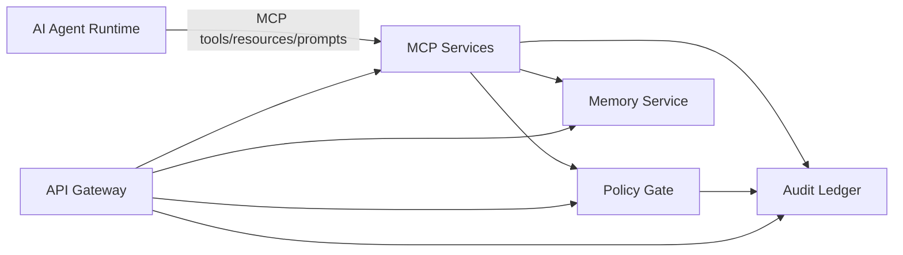

# Architecture Overview

This platform adds a **cognitive personality layer** and a **governed tool runtime** around LLM agents.

The key idea: **separate “what the agent wants” from “what the system allows”.**

- Personas influence *behavior* and *constraints*.
- Policy gate enforces permissions, budgets, and confirmations.
- Audit ledger makes actions explainable and reviewable.
- Memory exists, but is bounded by privacy and consent.

---

## Components

### Persona Packs
Versioned, signed bundles that define:
- voice and reasoning posture
- constraints (“must”, “never”)
- policy hints (defaults and tool rules)

### Policy Gate
Central decision engine.
Inputs:
- persona
- tool call proposal (name + args summary)
- identity and scopes
Outputs:
- allow/confirm/deny + reasons + required scopes + budget snapshot

### Audit Ledger
Append-only action record store:
- hash chained
- can be exported for audits or incident response

### Memory
Two kinds:
- session: TTL, ephemeral
- long-term: opt-in, user-scoped, deletable

### MCP Services
Expose tools/resources/prompts to clients.
MCP servers do not directly execute risky actions; they request policy decisions and record audits.

---

## “Final form” design principles

1. **Contract-first**: OpenAPI/AsyncAPI/MCP tool contracts define surfaces and are validated in CI.
2. **Least privilege**: each tool server has minimal capabilities.
3. **No prompt-only safety**: enforcement is code + policy + budgets.
4. **Auditability**: you can explain any action after the fact.
5. **Operator control**: control plane provides visibility and override workflows.

---

## Architecture diagram

See:
- `service-map.md`
- `data-flows.md`
