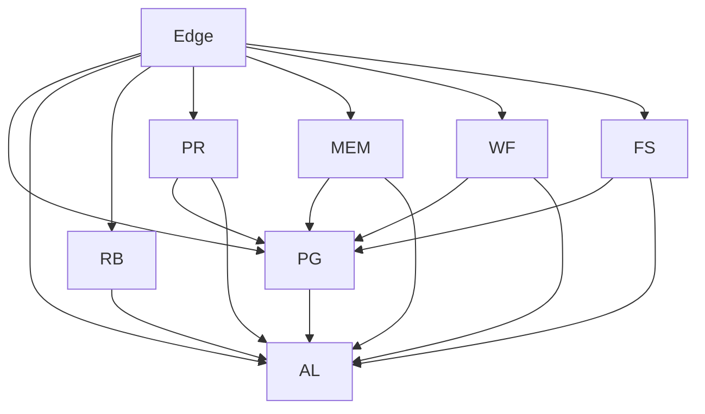

# Service Map

This document lists services, responsibilities, and dependencies.

> Rule: each service is deployable and contract-defined (OpenAPI/AsyncAPI; MCP contract for MCP services).

---

## Services

| Service | Path | Purpose | Primary dependencies | Data store |
|---|---|---|---|---|
| API Gateway | `services/edge/api-gateway` | ingress, auth, rate limits, routing | all services | none |
| Policy Gate | `services/trust-safety/policy-gate-service` | allow/confirm/deny decisions | risk-budget, audit-ledger | Postgres (policy + decisions) |
| Audit Ledger | `services/trust-safety/audit-ledger-service` | append-only audit log | none (ingested by others) | Postgres (WORM-ish) |
| Risk Budget | `services/trust-safety/risk-budget-service` | quotas, budgets, alerts | audit-ledger | Postgres/Redis |
| Persona Registry (MCP) | `services/mcp/persona-registry-service` | loads and serves persona packs | policy gate (for writes), audit-ledger | filesystem/object storage |
| Memory (MCP) | `services/mcp/memory-service` | session + long-term memory | policy gate, audit-ledger | Postgres + vector index |
| WebFetch Tool (MCP) | `services/mcp/tool-webfetch-service` | safe web retrieval | policy gate, audit-ledger | none |
| Files Tool (MCP) | `services/mcp/tool-files-service` | allowlisted filesystem ops | policy gate, audit-ledger | none |

---

## Dependency graph

---

## Package map

| Package | Purpose |
|---|---|
| `packages/persona-schema` | schema validation for personas and packs |
| `packages/persona-core` | load/merge/compose/render personas |
| `packages/persona-policy` | policy rules, budgets, scopes |
| `packages/persona-signing` | keygen/sign/verify for packs |
| `packages/persona-runtime` | middleware for host agent runtimes |
| `packages/mcp-sdk` | MCP client and transports |
| `packages/cli` | operator/developer CLI |

